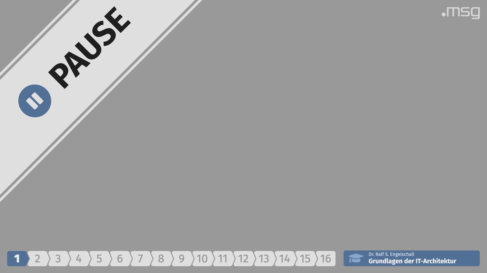

Training HUD for HUDS
======================

**Training HUD for Head-Up-Display Server (HUDS)**

<p/>


<p/>


Abstract
--------

This is a Head-Up-Display (HUD) running under the [Head-Up-Display Server
(HUDS)](https://github.com/rse/huds) for performing online trainings as Webinars.
It acts as a HUD or "overlay" in your video
production scenario. It is specially intended to be used with [OBS Studio](https://obsproject.com/)'s
[CEF](https://en.wikipedia.org/wiki/Chromium_Embedded_Framework)-based
[Browser Source](https://obsproject.com/wiki/Sources-Guide#browsersource)
and optionally the [Elgato Stream Deck](https://www.elgato.com/en/gaming/stream-deck)
remote control device and its [System:Website](https://help.elgato.com/hc/en-us/articles/360028234471-Elgato-Stream-Deck-System-Actions) function.

This HUD permanently displays an animated agenda list at the top-left,
an animated progress bar at the bottom-left, an animated title bar at
the bottom-right, and an animated logo at the top-right. In addition,
on-demand it displays one or more animated banners at the top-left.
The agenda, progress bar, title bar and banners can be controlled
either interactively via keystrokes (<kbd>a</kbd> for the agenda,
<kbd>LEFT</kbd>/<kbd>RIGHT</kbd> for the progress bar, <kbd>SPACE</kbd>
for the title bar and arbitrary configured keys for the banners) or
programmatically via HUDS' REST API.

Example
-------




Usage
-----

1.  **Install [Node.js](https://nodejs.org/):**<br/>
    First, install the [Node.js](https://nodejs.org/) run-time execution environment
    by following the instructions on the [Node.js](https://nodejs.org/) website.

2.  **Install and Start Training HUD:**<br/>
    Now install and start this training HUD with the help of the
    [Head-Up-Display Server (HUDS)](https://github.com/rse/huds)
    and optionally a customized [training configuration](./training.yaml).
    Here you have three different options:

    -   **Option 1**: Without any installation (directly from source tree):

        ```sh
        $ git clone https://github.com/rse/huds-hud-training
        $ cd huds-hud-training
        $ npm install
        $ vi training.yaml  # optionally edit the training configuration
        $ npm run huds -- \
            -a 127.0.0.1 -p 9999 \
            -d training:.,training.yaml
        ```

    -   **Option 2**: Without any installation (from distribution)

        ```sh
        $ curl -LO https://github.com/rse/huds-hud-training/raw/master/training.yaml
        $ vi training.yaml  # optionally edit the training configuration
        $ npx -p huds -p huds-hud-training huds \
            -a 127.0.0.1 -p 9999 \
            -d training:@huds-hud-training,training.yaml
        ```

    -   **Option 3**: With global system installation:

        ```sh
        $ npm install -g huds huds-hud-training
        $ curl -LO https://github.com/rse/huds-hud-training/raw/master/training.yaml
        $ vi training.yaml  # optionally edit the training configuration
        $ huds \
            -a 127.0.0.1 -p 9999 \
            -d training:@huds-hud-training,training.yaml
        ```

    Hint: when customizing the [training configuration](./training.yaml)
    feel free to both replace (for adjustment) or even completey
    kick-out (for disabling) the `title`, `progress`, `banner` and
    `logo` sections.

3.  **Start [OBS Studio](https://obsproject.com/)**:</br>
    Start [OBS Studio](https://obsproject.com/) and add a [Browser
    Source](https://obsproject.com/wiki/Sources-Guide#browsersource) to
    any scene. As the URL for the browser source use:

    ```
    http://127.0.0.1:9999/training/
    ```

4.  **Locally Control HUD** (Keystrokes):<br/>
    If you want to interact with the HUD directly from within [OBS Studio](https://obsproject.com/),
    right-click onto the browser source and
    choose "Interact". You can press <kbd>LEFT</kbd> (previous part),
    <kbd>RIGHT</kbd> (next part), <kbd>SPACE</kbd> (flash title),
    <kbd>p</kbd> (toggle Pause banner), <kbd>r</kbd> (toggle Rant
    banner) and <kbd>q</kbd> (toggle Q&A banner)
    in the interaction window.

5.  **Remote Control HUD (Programmatically)**:<br/>
    Now you can also programmatically control the HUD by remotely triggering the events
    from any shell with the help of the [cURL](https://curl.haxx.se/) utility:

    ```sh
	curl -D- http://127.0.0.1:9999/training/event/agenda.event=toggle
	curl -D- http://127.0.0.1:9999/training/event/progress.event=prev
	curl -D- http://127.0.0.1:9999/training/event/progress.event=next
	curl -D- http://127.0.0.1:9999/training/event/title.event=bounce
	curl -D- http://127.0.0.1:9999/training/event/banner-pause.event=toggle
	curl -D- http://127.0.0.1:9999/training/event/banner-rant.event=toggle
	curl -D- http://127.0.0.1:9999/training/event/banner-qna.event=toggle
    ```

6.  **Remote Control HUD (Device)**:<br/>
    Optionally, trigger the events from an
    [Elgato Stream Deck](https://www.elgato.com/en/gaming/stream-deck)
    remote control device and its [System:Website](https://help.elgato.com/hc/en-us/articles/360028234471-Elgato-Stream-Deck-System-Actions) functions.
    For this, generate key images with the help of the companion tool
    [Stream-Deck Key-Image Generator (SDKIG)](https://github.com/rse/sdkig)
	and the provided script [training-key.sh](./training-key.sh).
	Just use the [System:Website](https://help.elgato.com/hc/en-us/articles/360028234471-Elgato-Stream-Deck-System-Actions) function
	with the generated key images, the URLs above and just let them be executed in the background.

License
-------

Copyright &copy; 2020 Dr. Ralf S. Engelschall (http://engelschall.com/)

Permission is hereby granted, free of charge, to any person obtaining
a copy of this software and associated documentation files (the
"Software"), to deal in the Software without restriction, including
without limitation the rights to use, copy, modify, merge, publish,
distribute, sublicense, and/or sell copies of the Software, and to
permit persons to whom the Software is furnished to do so, subject to
the following conditions:

The above copyright notice and this permission notice shall be included
in all copies or substantial portions of the Software.

THE SOFTWARE IS PROVIDED "AS IS", WITHOUT WARRANTY OF ANY KIND,
EXPRESS OR IMPLIED, INCLUDING BUT NOT LIMITED TO THE WARRANTIES OF
MERCHANTABILITY, FITNESS FOR A PARTICULAR PURPOSE AND NONINFRINGEMENT.
IN NO EVENT SHALL THE AUTHORS OR COPYRIGHT HOLDERS BE LIABLE FOR ANY
CLAIM, DAMAGES OR OTHER LIABILITY, WHETHER IN AN ACTION OF CONTRACT,
TORT OR OTHERWISE, ARISING FROM, OUT OF OR IN CONNECTION WITH THE
SOFTWARE OR THE USE OR OTHER DEALINGS IN THE SOFTWARE.

